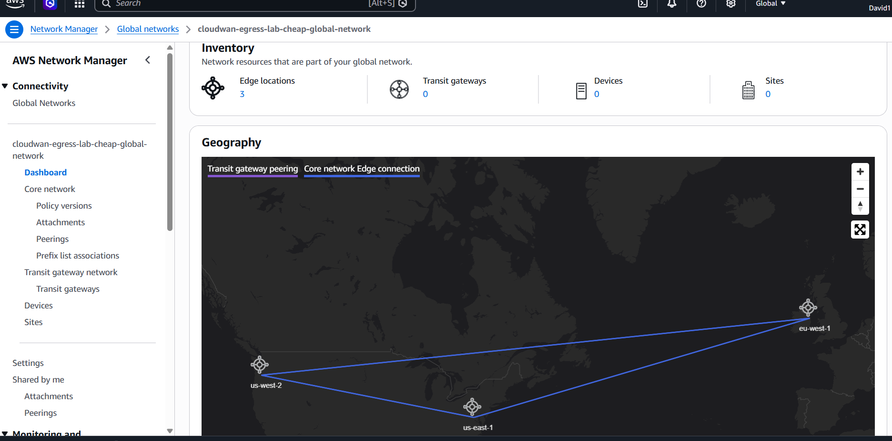
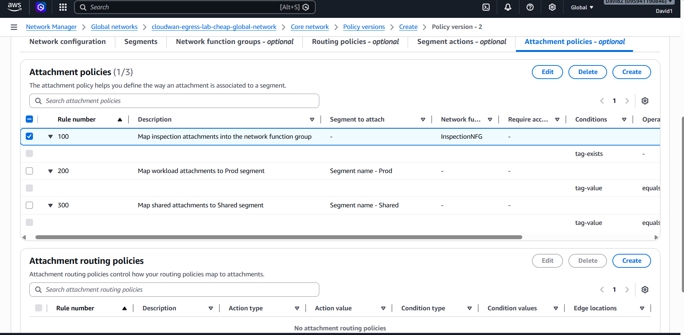
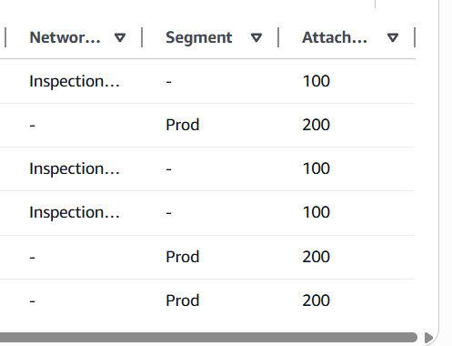
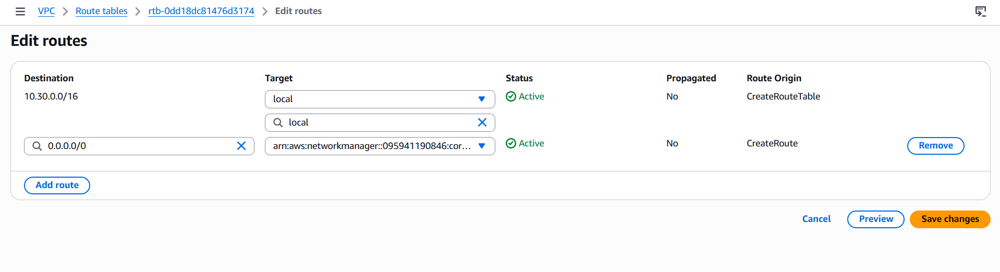
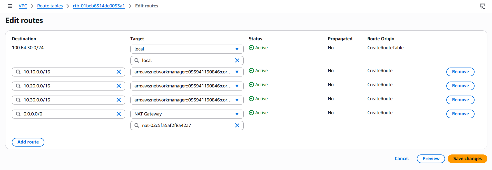
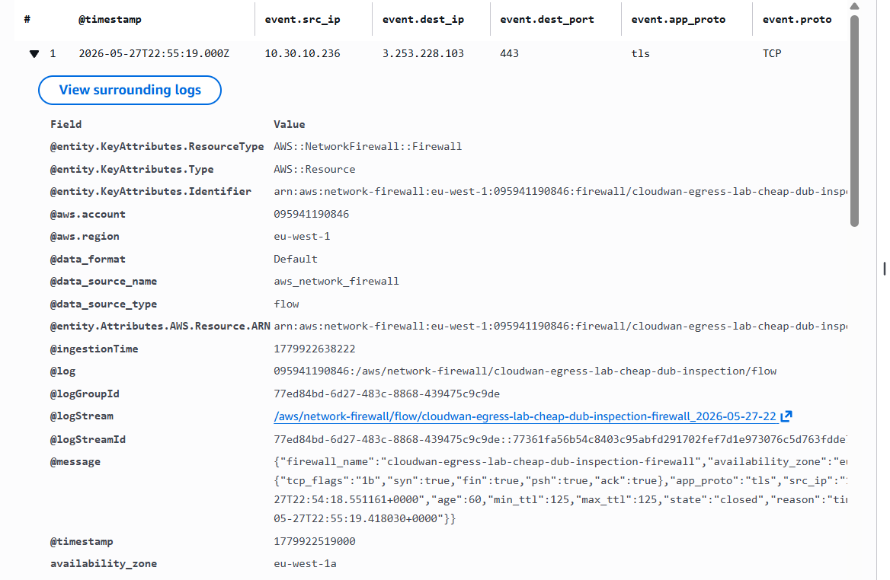

# AWS Cloud WAN Centralized Egress Lab

[](https://github.com/folk00/aws-cloudwan-centralized-egress-lab/actions/workflows/ci.yml)
[](https://www.terraform.io/)
[](https://aws.amazon.com/cloud-wan/)
[](LICENSE)

Terraform lab for AWS Cloud WAN, centralized egress, AWS Network Firewall and
CloudWatch validation.

The design builds a global network backbone across:

| Code | Region | AWS region |
| --- | --- | --- |
| IAD | Northern Virginia | `us-east-1` |
| PDX | Oregon | `us-west-2` |
| DUB | Ireland | `eu-west-1` |

## What This Builds

The full deployment creates:

- AWS Cloud WAN global network and core network.
- Core network edges in IAD, PDX and DUB.
- One workload VPC per region.
- One inspection/egress VPC per region.
- Cloud WAN VPC attachments.
- Tag-based attachment policies.
- A `Prod` segment.
- An `InspectionNFG` network function group.
- Optional Cloud WAN `send-to` service insertion for north-south egress.
- Optional AWS Network Firewall per region.
- Optional NAT Gateway and Internet Gateway per inspection VPC.
- Optional Network Firewall logs and VPC Flow Logs.
- Optional private Amazon Linux validation instances with SSM Session Manager.

The default variables are cost-safe:

```hcl
enable_cloudwan         = false
enable_network_firewall = false
enable_nat_gateway      = false
enable_vpc_flow_logs    = false
enable_test_instances   = false
```

This lets you run `terraform plan` safely and turn on expensive resources only
when you are ready.

## Architecture

```text
                 AWS Cloud WAN core network
           Core Network Edges: IAD, PDX, DUB
                          |
              +-----------+-----------+
              |                       |
          Prod segment          InspectionNFG
              |                       |
   +----------+----------+   +--------+--------+
   |          |          |   |        |        |
 IAD VPC   PDX VPC   DUB VPC IAD INSP PDX INSP DUB INSP
                                |        |        |
                              AWS Network Firewall
                                |        |        |
                              NAT GW   NAT GW   NAT GW
                                |        |        |
                               IGW      IGW      IGW
```

## Evidence Gallery

The repo includes screenshots from the live 3-region deployment. Keep the README
gallery short and use the docs for the full proof set.

| Cloud WAN overview | Attachment policies |
| --- | --- |
|  |  |

| Attachment mapping | Workload default route |
| --- | --- |
|  |  |

| Firewall route table | CloudWatch validation |
| --- | --- |
|  |  |

Full gallery:

- [GitHub screenshot gallery](docs/github-screenshot-gallery.md)
- [Terraform walkthrough](docs/cloudwan-terraform-walkthrough.html)
- [Lab guide](docs/cloudwan-lab-guide.html)

## Quick Start

Plan only:

```powershell
cd .\terraform
terraform init
terraform plan
```

Create a full lab variable file:

```powershell
Copy-Item ..\examples\full-lab.tfvars.example .\full-lab.auto.tfvars
terraform plan "-out=cloudwan-full.tfplan"
```

Or create the cheaper 2-region lab:

```powershell
Copy-Item ..\examples\cheap-2region-lab.tfvars.example .\cheap-2region.auto.tfvars
terraform plan "-out=cloudwan-cheap.tfplan"
```

Expand the current cheap deployment to 3 regions without renaming existing
resources:

```powershell
terraform plan "-var-file=..\examples\current-3region-lab.tfvars.example" "-out=cloudwan-3region.tfplan"
```

Apply only when you are ready for cost:

```powershell
terraform apply cloudwan-full.tfplan
```

Destroy right after the demo:

```powershell
terraform destroy
```

## Cost Warning

This is not a cheap always-on lab. The full 3-region version is designed for a
short demo window. See [docs/cost-estimate.md](docs/cost-estimate.md).

High-level monthly estimate for the full 3-region, 1-AZ-per-region deployment
with no meaningful traffic:

```text
Approx fixed monthly cost: USD 2,255 to 2,355/month
Approx 24-hour demo cost: USD 74 to 78
Approx 8-hour demo cost:  USD 25 to 26
Approx 2-hour 2-region demo cost: USD 4.15 to 4.35
```

The range depends on whether the NAT Gateway hourly/data discount applies in
the exact Network Firewall chained path.

## Repository Map

```text
docs/
  architecture.md       Packet flow and design notes
  cloudwan-policy.md    Segment, attachment and service-insertion notes
  cloudwan-lab-guide.html
  cloudwan-terraform-walkthrough.html
  cost-estimate.md      Full deployment cost model
  deployment-runbook.md Commands to validate, deploy and destroy
  github-screenshot-gallery.md
  screenshot-checklist.md
examples/
  full-lab.tfvars.example
  cheap-2region-lab.tfvars.example
  current-3region-lab.tfvars.example
scripts/
  estimate-cost.ps1     Local estimate helper
  validate.ps1          Format/init/validate helper
terraform/
  Cloud WAN, regional VPCs, inspection VPCs, routing and outputs
```

## Step-by-Step Manual

The illustrated manual is available here:

- [Cloud WAN lab guide](docs/cloudwan-lab-guide.html)
- [Terraform walkthrough](docs/cloudwan-terraform-walkthrough.html)
- [Screenshot checklist](docs/screenshot-checklist.md)

## Sources Used

- AWS Cloud WAN pricing: https://aws.amazon.com/cloud-wan/pricing/
- AWS Cloud WAN core network policy parameters: https://docs.aws.amazon.com/network-manager/latest/cloudwan/cloudwan-policies-json.html
- AWS Cloud WAN service insertion: https://docs.aws.amazon.com/network-manager/latest/cloudwan/cloudwan-policy-service-insertion.html
- AWS Cloud WAN egress inspection example: https://aws.amazon.com/blogs/networking-and-content-delivery/simplifying-egress-inspection-with-aws-cloud-wan-service-insertion-for-greenfield-deployments/
- AWS Network Firewall pricing: https://aws.amazon.com/network-firewall/pricing/
- Amazon VPC pricing: https://aws.amazon.com/vpc/pricing/
