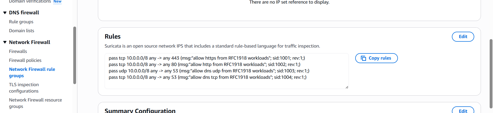
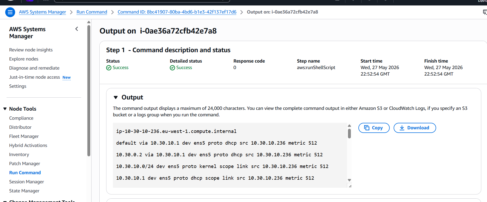

# GitHub Screenshot Gallery

Use this page as the screenshot source for the GitHub repo. The README should
show only a compact subset, while this page keeps the wider evidence trail.

## Recommended README Gallery

| Screenshot | What it proves |
| --- | --- |
|  | Cloud WAN global network deployed across `us-east-1`, `us-west-2` and `eu-west-1`. |
|  | Attachments are mapped by policy, not manually guessed. |
|  | Inspection VPCs map to `InspectionNFG`; workload VPCs map to `Prod`. |
|  | Private workload subnet sends default traffic to the Cloud WAN core network. |
|  | Inspection subnet sends egress to NAT and return traffic back to Cloud WAN. |
|  | AWS Network Firewall uses explicit stateful egress rules. |
|  | Private EC2 instance validates internet egress without a public IP. |
|  | CloudWatch confirms TLS/443 flow through Network Firewall. |

## Full Screenshot Inventory

| File | Purpose |
| --- | --- |
| `01-global-network-overview-3-edges.png` | Global network overview with three Cloud WAN edge locations. |
| `02-cloudwan-attachment-policies.png` | Tag-based attachment policy classification. |
| `03-network-function-group-inspectionnfg.png` | `InspectionNFG` network function group. |
| `04-segment-action-prod-send-to-inspectionnfg.png` | Service insertion from `Prod` to `InspectionNFG`. |
| `05-attachments-segment-and-nfg-mapping.png` | Attachment mapping into segment and network function group. |
| `06-workload-vpc-attachment-dub-private-subnet.png` | Workload attachment details. |
| `07-inspection-vpc-attachment-appliance-mode.png` | Inspection attachment with appliance mode. |
| `08-prod-segment-three-edge-locations.png` | `Prod` segment across all three regions. |
| `09-dub-route-tables-overview.png` | DUB route table inventory. |
| `10-dub-workload-private-rt-default-to-cloudwan.png` | Workload default route to Cloud WAN. |
| `11-dub-inspection-cloudwan-rt-default-to-firewall-endpoint.png` | Cloud WAN ingress route to Network Firewall endpoint. |
| `12-dub-inspection-firewall-rt-nat-and-cloudwan-return.png` | Firewall subnet route to NAT and return routes to Cloud WAN. |
| `13-dub-inspection-public-rt-igw-and-firewall-return.png` | Public/NAT subnet route to IGW and firewall return routes. |
| `14-network-firewall-stateful-egress-rules.png` | Stateful firewall rules. |
| `15-network-firewall-ready-in-sync.png` | Firewall ready state. |
| `16-nat-gateway-available.png` | NAT Gateway available state. |
| `17-private-ec2-instance-dub-no-public-ip.png` | Private validation instance. |
| `18-ssm-run-command-http-200-validation.png` | SSM validation command output. |
| `19-cloudwatch-flow-log-tls-443-validation.png` | Network Firewall flow log validation. |
| `20-resource-tags-governance.png` | Governance and cost tags. |

The Terraform walkthrough appendix screenshots live under
`docs/images/cloudwan/terraform-walkthrough/`.
